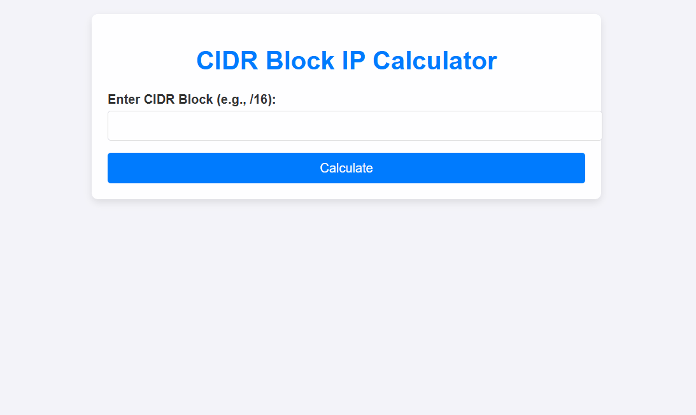

# 🌐 CIDR Block IP Calculator

<p align="center">
  
</p>

A lightweight web-based networking tool that calculates total, reserved, and usable IP addresses within a CIDR block.

Designed for subnet planning, networking education, and cloud infrastructure learning.

---

<p align="left">
  
  
  
  
  
</p>

---

# 🎬 Demo

The calculator in action:

<p align="center">
  
</p>

---

# 🚀 Features

- Calculate total IP addresses in CIDR blocks
- Calculate reserved IP addresses
- Calculate usable IP addresses
- CIDR input validation
- Step-by-step explanation of calculations
- Clean and responsive UI
- Fully browser-based (no installation required)

---

# 🛠 Technologies

- HTML5
- CSS3
- JavaScript (ES6)

---

# 📖 How to Use

## Option 1 — Open Locally

1. Download or clone the repository
2. Open:

```
CIDR-Block-IP-Calculator.html
```

3. Run it in any modern browser
4. Enter CIDR values like:

```
/16
/20
/24
/28
```

5. Click **Calculate**

---

## Option 2 — Git Clone

```bash
git clone https://github.com/tcdoverlord/CIDR-Block-IP-Calculator.git
cd CIDR-Block-IP-Calculator
```

Open the HTML file in your browser.

---

# 📊 Example

### Input
```
/24
```

### Output
```
Total IPs: 256
Reserved IPs: 5
Usable IPs: 251
```

---

# 📂 Project Structure

```
CIDR-Block-IP-Calculator/
│
├── CIDR-Block-IP-Calculator.html
├── CIDR-Block-IP-Calculator-demo.gif
├── README.md
└── LICENSE
```

---

# 💡 Use Cases

- Network engineering learning
- AWS / Azure VPC planning
- Subnetting practice
- IT training
- IPv4 addressing education

---

# 🤝 Contributing

Contributions are welcome.

Feel free to open issues or submit pull requests.

---

# 👨‍💻 Author

**TCDOverLord**

GitHub: https://github.com/tcdoverlord
